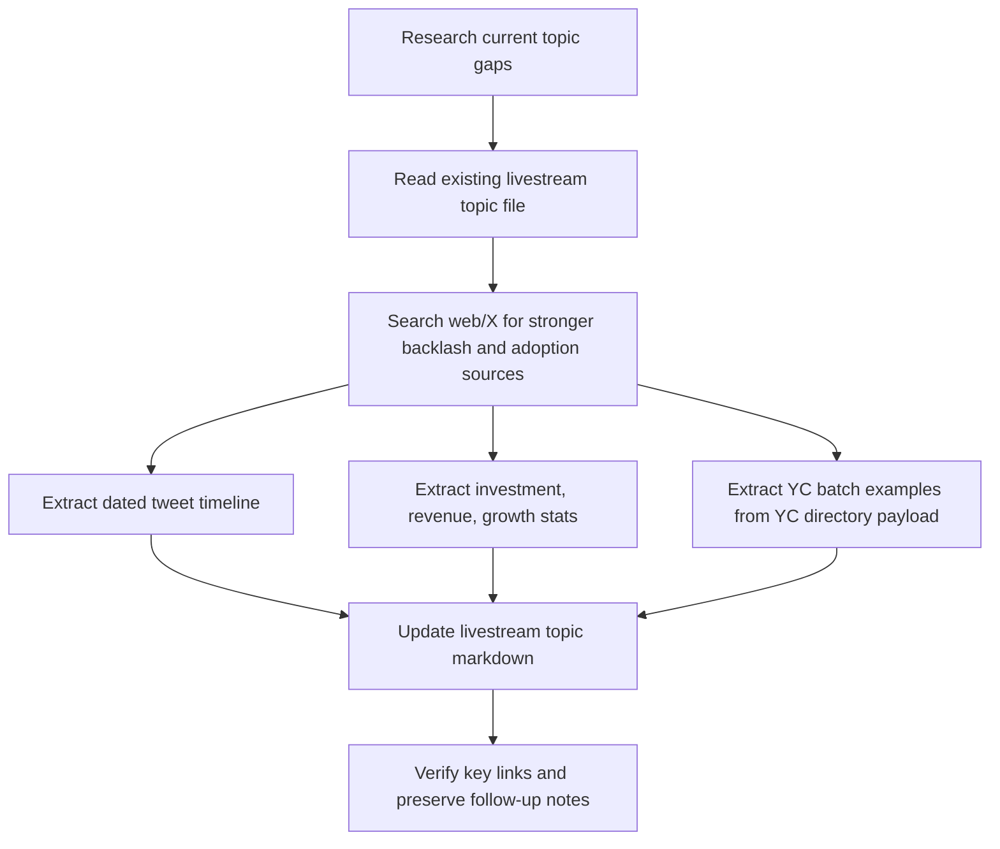

# 2026-04-15 - Ship Shit Show Live

## Summary

Expanded the `ai-backlash-doesnt-matter` livestream topic with a stronger X/Twitter timeline, AI capital and revenue framing, a YC-per-batch AI angle, and a physical-world backlash example using the Philadelphia delivery-robot vandalism coverage. Main output was a richer research doc for the April 15 livestream, not product code.

---

## Session 1: AI Backlash Topic Expansion

**Status:** Completed

### System Flow

### Affected Components

| Layer | Components |
|-------|------------|
| Content | `data/livestream/2026-04-15/topic-06-ai-backlash-doesnt-matter.md` |
| Research | Web/X sources for AI backlash, AI adoption, YC, and delivery robots |

### What was done

- [x] Read the existing `ai-backlash-doesnt-matter` topic and identified missing tweet density
- [x] Added a dated X timeline spanning January 2025 to April 2026
- [x] Added more concrete backlash examples from artists, YouTube slop cleanup, and WIT Studio
- [x] Added a pinned section for AI investment, revenue, growth, and YC framing
- [x] Extracted YC company examples across `W2025`, `S2025`, `F2025`, `W2026`, and `P2026`
- [x] Added Philadelphia delivery-robot vandalism coverage as a physical-world backlash example
- [x] Preserved a follow-up note that the exact TikTok permalink for the robot clip was not cleanly verified

### Key decisions

- **Decision:** Keep all new material inside the existing topic file instead of splitting out a second topic
  - **Context:** The user wanted the stream to go deeper on the same argument, not create a parallel episode
  - **Rationale:** One stronger topic page is easier to use live than multiple scattered notes

- **Decision:** Add a dedicated `Pinned — Money, Growth, YC` section near the top
  - **Context:** The user explicitly wanted to talk about investment, revenue, growth, and YC output
  - **Rationale:** These points are strongest as a fast-access on-stream block, not buried later in the doc

- **Decision:** Use YC company examples by batch instead of claiming a universal numeric count for every batch
  - **Context:** The public YC directory HTML exposed reliable company payloads but not a clean per-batch total across all AI pages without extra filtering ambiguity
  - **Rationale:** Named examples are defensible and more useful live than a shaky aggregate claim

- **Decision:** Use verified news coverage for the delivery-robot clip instead of forcing a weak TikTok source
  - **Context:** The user asked for the TikTok clip, but the stable original post was not confidently recoverable from search
  - **Rationale:** Verified local coverage is better than a brittle or wrong social link

### Files changed

- `data/livestream/2026-04-15/topic-06-ai-backlash-doesnt-matter.md` - expanded topic with timeline, X sources, pinned money/growth/YC section, and delivery-robot backlash angle
- `.agents/SESSIONS/2026-04-15.md` - created session log

### Mistakes and fixes

- Tried to use `python`; local environment only had `python3`
  - Switched to `python3` for HTML extraction scripts

- Initial patch failed because the topic file had changed since the previous read
  - Re-read the file with line numbers and patched against the live version

- Direct HTTP checks on some OpenAI and Axios links returned `403`
  - Kept the links when they were still valid public URLs, but treated those checks as incomplete and avoided over-claiming beyond what was already sourced

### Source Notes

- Verified Anthropic and YC public links directly
- Used the YC directory page payload embedded in HTML to pull recent batch examples
- Found reliable robot-backlash coverage here:
  - `https://6abc.com/post/center-city-philadelphia-puts-ubers-delivery-bot-test/18743488/`
  - `https://6abc.com/post/uber-eats-delivery-robot-gets-kicked-center-city-philadelphia/18817649/`
  - `https://www.inquirer.com/news/philadelphia/uber-eats-delivery-robot-kicked-center-city-hitchbot-20260401.html`

### Next steps

- [ ] If needed, do one more pass for stronger anti-AI / anti-agent tweets to increase live-scroll conflict
- [ ] If needed, tighten the pinned section into a 60-second opening monologue
- [ ] If needed, recover the original TikTok permalink for the Philly delivery-bot clip
