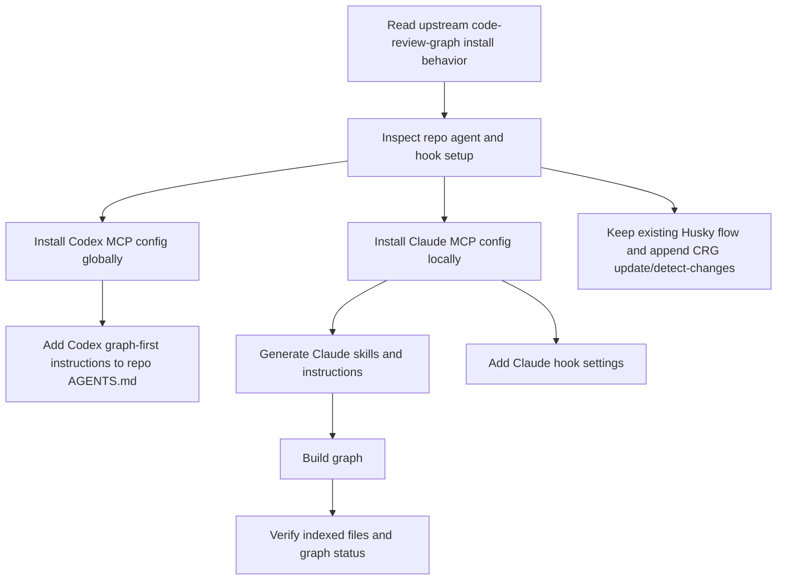
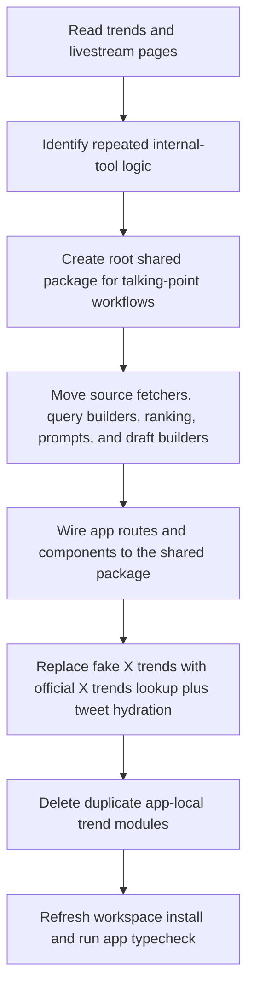
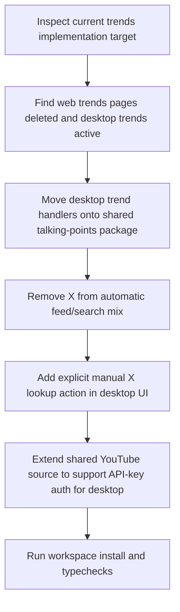
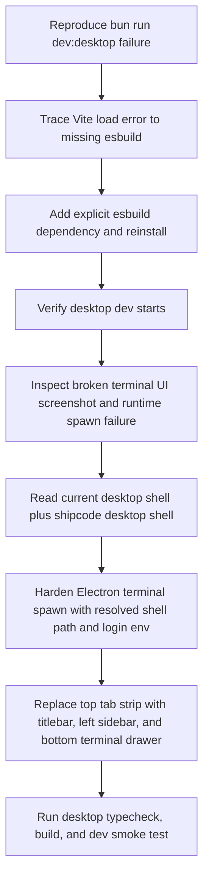

# 2026-04-21 - Ship Shit Show Live

## Summary

Installed `code-review-graph` for this repo for both Codex and Claude Code. Wired Codex MCP globally, Claude MCP and hooks locally, added graph-first instructions for both agents, integrated graph updates into the existing Husky pre-commit flow, and built the initial graph. Important caveat: the graph currently only indexes 2 tracked files because the `apps/` and `packages/` tree is mostly untracked in git right now.

---

## Session 1: code-review-graph Install For Codex And Claude

**Status:** Completed

### System Flow

### Affected Components

| Layer | Components |
|-------|------------|
| Agent config | `~/.codex/config.toml`, `.mcp.json`, `AGENTS.md`, `CLAUDE.md`, `.claude/settings.json`, `.claude/skills/` |
| Git workflow | `.husky/pre-commit` |
| Repo hygiene | `.gitignore`, `.code-review-graph/` |
| Tooling | `code-review-graph` CLI and local graph database |

### What was done

- [x] Verified upstream `code-review-graph` install behavior and config targets for Codex and Claude Code
- [x] Confirmed this machine already had `code-review-graph 2.3.2` available via `pipx`
- [x] Installed Codex MCP config into `~/.codex/config.toml`
- [x] Installed Claude Code MCP config into repo-local `.mcp.json`
- [x] Generated Claude Code skill files under `.claude/skills/`
- [x] Added graph-first instructions to repo-local `CLAUDE.md`
- [x] Added matching graph-first instructions to repo-local `AGENTS.md` for Codex
- [x] Added Claude session and post-tool hooks in `.claude/settings.json`
- [x] Integrated `code-review-graph update` and `detect-changes --brief` into the existing Husky pre-commit script instead of letting upstream write a separate `.git/hooks/pre-commit`
- [x] Added `.code-review-graph/` to `.gitignore`
- [x] Ran `code-review-graph build --repo .`
- [x] Ran `code-review-graph status --repo .` and verified the initial graph state

### Key decisions

- **Decision:** Reuse the existing machine-level `code-review-graph` install instead of forcing a new `uv tool` overwrite
  - **Context:** `uv tool install` failed because a `pipx`-managed `code-review-graph` binary already existed on the machine
  - **Rationale:** The existing install was current and working, so overwriting it was unnecessary risk

- **Decision:** Skip upstream git-hook installation and wire CRG into Husky instead
  - **Context:** This repo already uses `.husky/pre-commit`, while upstream writes directly to `.git/hooks/pre-commit`
  - **Rationale:** Keeping one pre-commit entry point avoids bypassing or fragmenting the repo’s existing hook flow

- **Decision:** Add repo-local `AGENTS.md` for Codex even though upstream only injects agent instructions for some other platforms
  - **Context:** The user explicitly wanted the setup to work for both Codex and Claude in this repo
  - **Rationale:** Codex needed the same graph-first instruction block locally so both agents bias toward CRG tools in this project

- **Decision:** Record the tracked-files limitation as the main follow-up risk
  - **Context:** `code-review-graph` uses `git ls-files` in git repos, and this repo currently has 0 tracked files under `apps/` and `packages/`
  - **Rationale:** The install is correct, but graph usefulness will stay low until the active tree is tracked

### Files changed

- `AGENTS.md` - added graph-first instructions for Codex
- `CLAUDE.md` - added graph-first instructions for Claude Code
- `.mcp.json` - added Claude Code MCP server config for `code-review-graph`
- `.claude/settings.json` - added Claude hooks to show graph status on session start and update graph after edits/bash usage
- `.claude/skills/debug-issue.md` - generated by `code-review-graph`
- `.claude/skills/explore-codebase.md` - generated by `code-review-graph`
- `.claude/skills/refactor-safely.md` - generated by `code-review-graph`
- `.claude/skills/review-changes.md` - generated by `code-review-graph`
- `.husky/pre-commit` - appended graph update and brief change-impact analysis
- `.gitignore` - added `.code-review-graph/`
- `.agents/SESSIONS/2026-04-21.md` - created session log
- `~/.codex/config.toml` - added Codex MCP server config for `code-review-graph`

### Mistakes and fixes

- Tried `uv tool install code-review-graph`
  - It failed because the executable already existed from a `pipx` install
  - Reused the existing `code-review-graph 2.3.2` binary instead of forcing overwrite

- Upstream installer would have handled hooks differently from this repo
  - Checked Husky and `.git/hooks` first
  - Disabled upstream hook installation and appended CRG commands to `.husky/pre-commit`

- Initial build looked suspiciously small
  - Verified `code-review-graph` uses `git ls-files` for tracked files in git repos
  - Confirmed the active `apps/` and `packages/` tree is mostly untracked, which explains the 2-file graph

### Verification

- `code-review-graph --version`
  - Confirmed `2.3.2`

- `code-review-graph build --repo .`
  - Built graph successfully
  - Result: `2 files`, `11 nodes`, `49 edges`

- `code-review-graph status --repo .`
  - Confirmed graph exists and reports `Files: 2`

- Verified generated config:
  - `~/.codex/config.toml`
  - `.mcp.json`
  - `.claude/settings.json`
  - `.husky/pre-commit`

### Next steps

- [ ] Restart Codex and Claude Code so both pick up the new MCP and hook config
- [ ] Track or commit the active `apps/` and `packages/` tree if you want `code-review-graph` to index the real app code
- [ ] Re-run `code-review-graph build --repo .` after those files are tracked

---

## Session 2: Talking-Points Package Extraction

**Status:** Completed

### System Flow

### Affected Components

| Layer | Components |
|-------|------------|
| Shared package | `packages/talking-points/*` |
| App routes | `apps/app/src/app/api/trends/*` |
| App UI | `apps/app/src/components/trends/TrendsClient.tsx`, `apps/app/src/components/livestream/TopicDetailClient.tsx` |
| App helpers | `apps/app/src/lib/dev-terminal-events.ts`, `apps/app/src/lib/talking-points-sources.ts` |

### What was done

- [x] Read the live trends and livestream topic pages to derive the actual internal-tool workflow
- [x] Added a new root workspace package `@shipshitshow/talking-points`
- [x] Moved shared discovery logic into the package:
  - source fetchers for Hacker News, Reddit, X, and YouTube
  - AI relevance filtering and ranking
  - keyword extraction and topic-query building
  - livestream topic draft builder
  - terminal research prompt builders
- [x] Rewired `/api/trends` and `/api/trends/search` to use the shared package
- [x] Rewired the trends page and livestream topic page to use shared prompt/query/draft helpers
- [x] Replaced the old X feed logic with official X trends lookup plus representative-tweet hydration
- [x] Removed duplicate app-local `src/lib/trends/*` modules
- [x] Ran `bun install` to register the new workspace package
- [x] Ran `bun run check:types` in `apps/app`

### Key decisions

- **Decision:** Scope the shared package to internal discovery and talking-point prep only
  - **Context:** The user clarified this app is an internal livestream-prep tool, not a publishing or distribution system
  - **Rationale:** Avoids overbuilding around posting, scheduling, or outbound automation the product does not need yet

- **Decision:** Keep Reddit on the existing free no-auth path
  - **Context:** The user does not have Reddit API credentials and asked to check the current codebase
  - **Rationale:** The live implementation used public Reddit JSON endpoints, not authenticated Reddit API calls, so the shared package preserved that free path

- **Decision:** Change X discovery to use the official X trends API
  - **Context:** The previous implementation used three hard-coded recent-search queries and treated them as “trends”
  - **Rationale:** The new package uses official X trend topics first, then hydrates those topics with representative tweets so the existing UI still has usable preview content

- **Decision:** Keep YouTube auth resolution app-local
  - **Context:** The app already has runtime-specific token helpers tied to its storage and auth flow
  - **Rationale:** Shared package owns discovery logic; app-local code owns credential plumbing

### Files changed

- `packages/talking-points/*` - new shared workspace package for internal talking-point discovery
- `apps/app/src/lib/talking-points-sources.ts` - app-specific wrappers for env and YouTube auth
- `apps/app/src/app/api/trends/route.ts` - switched to shared trends response builder
- `apps/app/src/app/api/trends/search/route.ts` - switched to shared search response builder
- `apps/app/src/components/trends/TrendsClient.tsx` - switched to shared keyword, prompt, and draft helpers
- `apps/app/src/components/livestream/TopicDetailClient.tsx` - switched to shared topic-search query builder
- `apps/app/src/lib/dev-terminal-events.ts` - switched to shared single-trend research prompt builder
- `apps/app/src/lib/trends/*` - deleted duplicate app-local trend modules
- `apps/app/package.json` - added workspace dependency on `@shipshitshow/talking-points`
- `bun.lock` - updated workspace lockfile after install

### Verification

- `bun install`
- `bun run check:types` in `apps/app`

### Next steps

- [ ] If wanted, swap the Reddit source from free public JSON to true RSS-only ingestion
- [ ] If wanted, tune X trend hydration further for AI/dev-topic density
- [ ] If wanted, add another app consumer for the shared `@shipshitshow/talking-points` package

---

## Session 3: Desktop Trends Switched To Manual X Follow-Up

**Status:** Completed

### System Flow

### Affected Components

| Layer | Components |
|-------|------------|
| Shared types | `packages/types/src/trends.ts`, `packages/types/src/index.ts` |
| Shared package | `packages/talking-points/src/feed.ts`, `packages/talking-points/src/youtube.ts` |
| Desktop main | `apps/desktop/src/main/ipc/trends.ts`, `apps/desktop/src/main/lib/talking-points-sources.ts`, `apps/desktop/package.json` |
| Desktop renderer | `apps/desktop/src/preload/index.ts`, `apps/desktop/src/renderer/electron.d.ts`, `apps/desktop/src/renderer/components/trends/*` |

### What was done

- [x] Re-checked the current repo state and confirmed the live trends workflow had moved to `apps/desktop`
- [x] Switched desktop trends IPC to use the shared `@shipshitshow/talking-points` package
- [x] Removed X from the automatic feed and automatic cross-source search flow
- [x] Marked X as a manual source in the trend-source status model
- [x] Added a dedicated `Check X` action in the desktop trends UI for selected topics
- [x] Preserved deep-dive results from HN, Reddit, and YouTube while layering in manual X results separately
- [x] Switched desktop livestream topic creation to use the shared draft builder
- [x] Extended the shared YouTube source to work with either OAuth access tokens or a plain API key so desktop can reuse it cleanly
- [x] Ran `bun install`
- [x] Ran `bun run check:types` in `apps/desktop`
- [x] Re-ran `bun run check:types` in `apps/app`

### Key decisions

- **Decision:** Treat X as a manual follow-up source, not an automatic discovery source
  - **Context:** The user wanted X checked only after seeing what Reddit, HN, and YouTube surfaced
  - **Rationale:** Keeps the core feed focused on free/high-signal sources and uses X only for explicit reaction lookup

- **Decision:** Land the behavioral change in `apps/desktop`, not the old web pages
  - **Context:** Earlier app-centric assumptions were stale; the repo had already deleted the old web trends page files and the active internal tool lived in desktop
  - **Rationale:** Changing dead web code would have been noise; desktop is the real operator workflow now

- **Decision:** Add API-key support to the shared YouTube source
  - **Context:** The shared package previously assumed OAuth access tokens, while desktop uses `YOUTUBE_API_KEY`
  - **Rationale:** This lets both app runtimes consume the same shared logic without duplicating YouTube discovery code again

### Files changed

- `packages/types/src/trends.ts` - added `manual` source status support
- `packages/types/src/index.ts` - exported the new trend source status type
- `packages/talking-points/src/feed.ts` - trimmed search queries and supported the new status type
- `packages/talking-points/src/youtube.ts` - added API-key-compatible YouTube fetch/search support
- `apps/desktop/package.json` - added workspace dependency on `@shipshitshow/talking-points`
- `apps/desktop/src/main/lib/talking-points-sources.ts` - new shared-package wrappers for desktop HN, Reddit, YouTube, and manual X
- `apps/desktop/src/main/ipc/trends.ts` - switched desktop feed/search to shared talking-points logic and added `trends:search-x`
- `apps/desktop/src/preload/index.ts` - exposed `searchX` on the renderer bridge
- `apps/desktop/src/renderer/electron.d.ts` - typed the new manual X bridge method
- `apps/desktop/src/renderer/components/trends/TrendsView.tsx` - removed X from feed filters, marked it manual, and added explicit X lookup behavior
- `apps/desktop/src/renderer/components/trends/TrendActionBar.tsx` - added the `Check X` action
- `apps/desktop/src/renderer/components/trends/TrendFilters.tsx` - removed X from automatic feed filters

### Mistakes and fixes

- Initially followed the earlier web-app context too literally
  - Re-read the current repo tree and git status
  - Noticed the trends pages under `apps/app` were deleted and the live workflow had shifted to `apps/desktop`
  - Moved the implementation target before making behavioral edits

- Shared YouTube logic did not initially fit desktop auth
  - The package expected bearer-token auth only
  - Added API-key support instead of duplicating another desktop-local YouTube fetcher

### Verification

- `bun install`
- `bun run check:types` in `apps/desktop`
- `bun run check:types` in `apps/app`

### Next steps

- [ ] Do a manual desktop Trends-tab UI pass to confirm the `Check X` flow reads well in practice
- [ ] If wanted, remove or consolidate the older duplicated desktop-local trend helper modules now that the active flow is on the shared package
- [ ] If wanted, add GitHub as another free/high-signal automatic source beside HN, Reddit, and YouTube

---

## Session 3: Desktop Shell Recovery And ShipCode-Style Layout

**Status:** Completed

### System Flow

### Affected Components

| Layer | Components |
|-------|------------|
| Desktop dependencies | `apps/desktop/package.json`, `bun.lock` |
| Main process | `apps/desktop/src/main/ipc/terminal.ts` |
| Renderer shell | `apps/desktop/src/renderer/App.tsx`, `apps/desktop/src/renderer/components/shell/*` |
| Renderer terminal | `apps/desktop/src/renderer/components/TerminalView.tsx`, `apps/desktop/src/renderer/electron.d.ts` |

### What was done

- [x] Reproduced the desktop startup failure from `bun run dev:desktop`
- [x] Confirmed `vite-plugin-electron-renderer` hard-requires `esbuild` at config-load time
- [x] Added explicit `esbuild` dependency to the desktop workspace and refreshed installs
- [x] Verified the original missing-module error was gone
- [x] Investigated the terminal runtime failure shown in the screenshot: `terminal:spawn` -> `posix_spawnp failed`
- [x] Read the current desktop shell implementation and the equivalent `shipcode` desktop shell before editing
- [x] Reworked terminal spawning to resolve a real shell path and shell-derived environment inside Electron
- [x] Added renderer-side terminal error handling so shell startup failures render useful diagnostics instead of a broken empty terminal
- [x] Replaced the old top-tab desktop shell with a `shipcode`-style shell:
  - titlebar actions
  - collapsible left sidebar
  - bottom terminal drawer with maximize/restore
  - keyboard toggles for sidebar and terminal
- [x] Ran desktop typecheck, production build, and dev startup smoke verification

### Key decisions

- **Decision:** Add `esbuild` explicitly to the desktop package instead of relying on Vite/Bun peer resolution
  - **Context:** `vite-plugin-electron-renderer` uses a direct runtime `require('esbuild')`, but the workspace did not actually install it
  - **Rationale:** Matching the working `shipcode` pattern removes peer-resolution ambiguity and makes the desktop package self-sufficient

- **Decision:** Fix terminal spawning by resolving a trusted absolute shell path and login env
  - **Context:** The Electron app was spawning a bare shell name, which is fragile under GUI app PATH/env rules and caused `posix_spawnp failed`
  - **Rationale:** Using an absolute shell path plus shell-derived env is the same class of hardening already used in `shipcode`'s process manager

- **Decision:** Port the shell shape from `shipcode` instead of iterating on the current top nav
  - **Context:** The user explicitly wanted the `shipcode` interaction model: left sidebar and bottom terminal toggle/drawer
  - **Rationale:** Reusing the existing product pattern is faster to review and lowers design drift across related desktop apps

- **Decision:** Keep scope to layout and terminal infrastructure only
  - **Context:** The repo already had substantial unrelated in-progress work across `apps/app` and newly added desktop files
  - **Rationale:** Avoids reverting or entangling unrelated local changes while still fixing the desktop shell and terminal behavior

### Files changed

- `apps/desktop/package.json` - added explicit `esbuild` and direct `lucide-react` dependency
- `bun.lock` - refreshed workspace lockfile after install
- `apps/desktop/src/main/ipc/terminal.ts` - resolved shell path/env and safer spawn fallback behavior
- `apps/desktop/src/renderer/electron.d.ts` - widened terminal spawn response typing for error-aware renderer handling
- `apps/desktop/src/renderer/components/TerminalView.tsx` - improved terminal lifecycle, cleanup, and spawn-failure display
- `apps/desktop/src/renderer/App.tsx` - replaced top-tab shell with sidebar + titlebar + bottom terminal drawer layout
- `apps/desktop/src/renderer/components/shell/Sidebar.tsx` - new left navigation shell component
- `apps/desktop/src/renderer/components/shell/Titlebar.tsx` - new top action bar with sidebar and terminal toggles
- `apps/desktop/src/renderer/components/shell/TerminalDrawer.tsx` - new bottom terminal drawer with resize/maximize controls

### Mistakes and fixes

- Initial fix only addressed the missing `esbuild` dependency
  - That got Vite booting again, but the screenshot exposed a second, separate failure in terminal spawn and shell layout
  - Continued into runtime debugging instead of stopping at the first green startup

- The first desktop shell was a top tab strip with the terminal as just another view
  - This did not match the requested `shipcode` UX at all
  - Replaced it with a dedicated shell layout and persistent bottom terminal drawer model

- Electron shell spawning depended on bare command resolution
  - That is brittle in GUI app environments
  - Switched to explicit shell-path resolution and login-env capture before spawning `node-pty`

### Verification

- `bun install`
  - Lockfile refreshed cleanly

- `bun run check:types` in `apps/desktop`
  - Passed

- `bun run build` in `apps/desktop`
  - Passed for renderer, main, and preload outputs

- `bun run dev:desktop`
  - Started successfully after the fixes
  - The prior `Cannot find module 'esbuild'` error did not recur
  - The prior `terminal:spawn` / `posix_spawnp failed` error did not recur during the smoke run

### Next steps

- [ ] Open the desktop app interactively and confirm the sidebar/drawer behavior feels right in the actual Electron window
- [ ] Decide whether to port more of `shipcode`'s titlebar/sidebar polish or keep this lighter shell
- [ ] If wanted, extract the shell pattern into shared desktop UI primitives once the desktop app stabilizes
