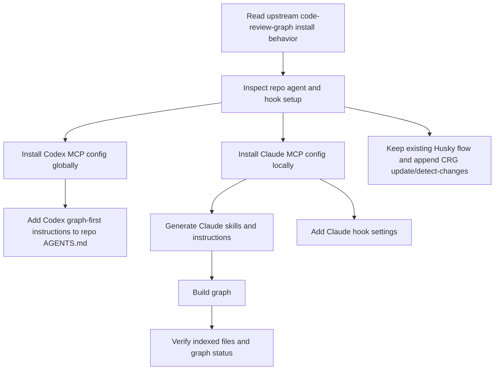

# 2026-04-21 - Ship Shit Show Live

## Summary

Installed `code-review-graph` for this repo for both Codex and Claude Code. Wired Codex MCP globally, Claude MCP and hooks locally, added graph-first instructions for both agents, integrated graph updates into the existing Husky pre-commit flow, and built the initial graph. Important caveat: the graph currently only indexes 2 tracked files because the `apps/` and `packages/` tree is mostly untracked in git right now.

---

## Session 1: code-review-graph Install For Codex And Claude

**Status:** Completed

### System Flow

### Affected Components

| Layer | Components |
|-------|------------|
| Agent config | `~/.codex/config.toml`, `.mcp.json`, `AGENTS.md`, `CLAUDE.md`, `.claude/settings.json`, `.claude/skills/` |
| Git workflow | `.husky/pre-commit` |
| Repo hygiene | `.gitignore`, `.code-review-graph/` |
| Tooling | `code-review-graph` CLI and local graph database |

### What was done

- [x] Verified upstream `code-review-graph` install behavior and config targets for Codex and Claude Code
- [x] Confirmed this machine already had `code-review-graph 2.3.2` available via `pipx`
- [x] Installed Codex MCP config into `~/.codex/config.toml`
- [x] Installed Claude Code MCP config into repo-local `.mcp.json`
- [x] Generated Claude Code skill files under `.claude/skills/`
- [x] Added graph-first instructions to repo-local `CLAUDE.md`
- [x] Added matching graph-first instructions to repo-local `AGENTS.md` for Codex
- [x] Added Claude session and post-tool hooks in `.claude/settings.json`
- [x] Integrated `code-review-graph update` and `detect-changes --brief` into the existing Husky pre-commit script instead of letting upstream write a separate `.git/hooks/pre-commit`
- [x] Added `.code-review-graph/` to `.gitignore`
- [x] Ran `code-review-graph build --repo .`
- [x] Ran `code-review-graph status --repo .` and verified the initial graph state

### Key decisions

- **Decision:** Reuse the existing machine-level `code-review-graph` install instead of forcing a new `uv tool` overwrite
  - **Context:** `uv tool install` failed because a `pipx`-managed `code-review-graph` binary already existed on the machine
  - **Rationale:** The existing install was current and working, so overwriting it was unnecessary risk

- **Decision:** Skip upstream git-hook installation and wire CRG into Husky instead
  - **Context:** This repo already uses `.husky/pre-commit`, while upstream writes directly to `.git/hooks/pre-commit`
  - **Rationale:** Keeping one pre-commit entry point avoids bypassing or fragmenting the repo’s existing hook flow

- **Decision:** Add repo-local `AGENTS.md` for Codex even though upstream only injects agent instructions for some other platforms
  - **Context:** The user explicitly wanted the setup to work for both Codex and Claude in this repo
  - **Rationale:** Codex needed the same graph-first instruction block locally so both agents bias toward CRG tools in this project

- **Decision:** Record the tracked-files limitation as the main follow-up risk
  - **Context:** `code-review-graph` uses `git ls-files` in git repos, and this repo currently has 0 tracked files under `apps/` and `packages/`
  - **Rationale:** The install is correct, but graph usefulness will stay low until the active tree is tracked

### Files changed

- `AGENTS.md` - added graph-first instructions for Codex
- `CLAUDE.md` - added graph-first instructions for Claude Code
- `.mcp.json` - added Claude Code MCP server config for `code-review-graph`
- `.claude/settings.json` - added Claude hooks to show graph status on session start and update graph after edits/bash usage
- `.claude/skills/debug-issue.md` - generated by `code-review-graph`
- `.claude/skills/explore-codebase.md` - generated by `code-review-graph`
- `.claude/skills/refactor-safely.md` - generated by `code-review-graph`
- `.claude/skills/review-changes.md` - generated by `code-review-graph`
- `.husky/pre-commit` - appended graph update and brief change-impact analysis
- `.gitignore` - added `.code-review-graph/`
- `.agents/SESSIONS/2026-04-21.md` - created session log
- `~/.codex/config.toml` - added Codex MCP server config for `code-review-graph`

### Mistakes and fixes

- Tried `uv tool install code-review-graph`
  - It failed because the executable already existed from a `pipx` install
  - Reused the existing `code-review-graph 2.3.2` binary instead of forcing overwrite

- Upstream installer would have handled hooks differently from this repo
  - Checked Husky and `.git/hooks` first
  - Disabled upstream hook installation and appended CRG commands to `.husky/pre-commit`

- Initial build looked suspiciously small
  - Verified `code-review-graph` uses `git ls-files` for tracked files in git repos
  - Confirmed the active `apps/` and `packages/` tree is mostly untracked, which explains the 2-file graph

### Verification

- `code-review-graph --version`
  - Confirmed `2.3.2`

- `code-review-graph build --repo .`
  - Built graph successfully
  - Result: `2 files`, `11 nodes`, `49 edges`

- `code-review-graph status --repo .`
  - Confirmed graph exists and reports `Files: 2`

- Verified generated config:
  - `~/.codex/config.toml`
  - `.mcp.json`
  - `.claude/settings.json`
  - `.husky/pre-commit`

### Next steps

- [ ] Restart Codex and Claude Code so both pick up the new MCP and hook config
- [ ] Track or commit the active `apps/` and `packages/` tree if you want `code-review-graph` to index the real app code
- [ ] Re-run `code-review-graph build --repo .` after those files are tracked
