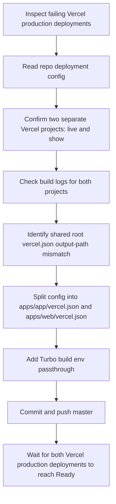
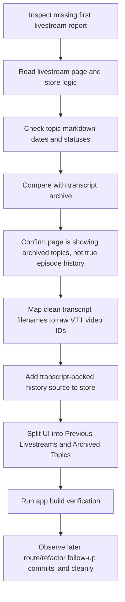

# 2026-04-22 - Ship Shit Show Live

## Summary

Wrapped the Vercel monorepo deployment fix and the livestream-history cleanup. Confirmed `master` now deploys both Vercel web apps when the split app-level config is in place, and clarified that the old `/livestream` page was mixing up archived topics with actual past livestream episodes. Final observed repo state ended clean on `master` at `498953e`, with additional livestream follow-up commits landing while the session was open.

---

## Session 1: Vercel Monorepo Deploy Fix

**Status:** Completed

### System Flow

### Affected Components

| Layer | Components |
|-------|------------|
| Deployment config | `vercel.json`, `apps/app/vercel.json`, `apps/web/vercel.json` |
| Build pipeline | `turbo.json` |
| Hosting | Vercel projects `live.shipshit.dev` and `show.shipshit.dev` |

### What was done

- [x] Checked local git state and Vercel project wiring instead of assuming `master` deployed everything
- [x] Verified this repo is connected to two separate Vercel projects: `live.shipshit.dev` and `show.shipshit.dev`
- [x] Pulled failing deployment logs and confirmed the build succeeded but Vercel looked for `.next` in the wrong directory
- [x] Removed the repo-root `vercel.json` that was being misapplied across both projects
- [x] Added app-local `vercel.json` files under `apps/app` and `apps/web`
- [x] Added explicit Turbo build-time env passthrough in `turbo.json`
- [x] Committed the fix as `e6f0d72 fix(vercel): split monorepo deployment config`
- [x] Verified both production deployments for that fix reached `Ready`
- [x] Captured the follow-up install-command correction that later landed as `a398d6d fix(vercel): restore install command in deployment configuration`

### Key decisions

- **Decision:** Treat this as a config bug, not a cache bug
  - **Context:** The initial suspicion was that Vercel had cached the wrong output location
  - **Rationale:** The build logs showed successful builds followed by a deterministic lookup of the wrong output directory, which points to config, not cache

- **Decision:** Split deployment config per app instead of keeping one root `vercel.json`
  - **Context:** This repo deploys two separate web apps from one monorepo
  - **Rationale:** Each Vercel project needs config relative to its own root directory; one shared root config caused cross-project path breakage

- **Decision:** Add Turbo env passthrough at the repo level
  - **Context:** Vercel warned that several production env vars would not be available to the build
  - **Rationale:** The warning was not the immediate outage, but leaving it unresolved would make future builds fragile

### Files changed

- `vercel.json` - deleted the root-level monorepo config that was breaking both projects
- `apps/app/vercel.json` - added app-specific Vercel build/install/output config
- `apps/web/vercel.json` - added web-specific Vercel build/install/output config
- `turbo.json` - added build-time env passthrough for Vercel/Turbo

### Mistakes and fixes

- First instinct was that Vercel may have cached a bad build path
  - Deployment logs showed the real issue was output-directory resolution after a successful build
  - Fixed by splitting config per deployed app

- The repo state changed during the session
  - The branch moved from local staged changes to clean/pushed state while work was in progress
  - Re-checked `git status`, `git log`, and Vercel deployment metadata before documenting the final state

### Verification

- `vercel inspect liveshipshit-e2cxdbimn-shipshitdev.vercel.app --wait --timeout 180s`
  - Reached `Ready`

- `vercel inspect showshipshit-elm8h43tf-shipshitdev.vercel.app --wait --timeout 180s`
  - Reached `Ready`

- `curl -I https://live.shipshit.dev`
  - Confirmed Vercel is serving the live app and redirecting `/` to `/analytics`

- `curl -I https://show.shipshit.dev`
  - Confirmed Vercel is serving the public site on the custom domain

### Next steps

- [ ] Keep future Vercel project config app-local for monorepo deploy targets
- [ ] If production env usage expands, add any newly required vars to `turbo.json`

---

## Session 2: Livestream History Clarification And Centralization

**Status:** Completed

### System Flow

### Affected Components

| Layer | Components |
|-------|------------|
| Livestream UI | `apps/app/src/app/livestream/page.tsx` |
| Livestream data | `apps/app/src/lib/livestream-store.ts`, `apps/app/src/lib/livestream-youtube.ts` |
| Topic detail UI | `apps/app/src/components/livestream/TopicDetailClient.tsx` |
| Content data | `apps/app/data/livestream/2026-04-21/*`, transcript archive under `apps/app/data/transcripts/clean/` |
| Follow-up route migration | `apps/app/src/app/api/livestreams/*`, `apps/app/src/app/livestreams/*`, related renamed helpers |

### What was done

- [x] Read the livestream page and confirmed it only showed:
  - current-date topics with `status: "in_progress"`
  - all topics with `status: "done"` in the archive section
- [x] Verified the topic store only started at `2026-04-07`, which is why earlier livestreams never appeared there
- [x] Verified the transcript archive contains older livestreams back to `2026-02-04`
- [x] Identified the earliest archived livestream in-repo as `2026-02-04 - Don't connect OpenClaw to Moltbook until you watch this`
- [x] Confirmed there was no active Notion connector or repo-local Notion integration available in this session
- [x] Implemented a transcript-backed previous-livestream history path and separated it from archived topics
- [x] Verified the app build passed during that history implementation
- [x] Observed later livestream follow-up commits land on top:
  - `487cea3 feat(livestream): implement livestream history feature and enhance topic management`
  - `0418d59 refactor(livestream): migrate API routes to new structure and enhance topic management`
  - `5cb9fc4 fix(livestream): correct import path for API route and improve redirect formatting`
  - `498953e feat(livestream): add new community image example from @yash_yk45`

### Key decisions

- **Decision:** Use the transcript archive as the immediate source of truth for old livestream history
  - **Context:** Earlier livestream episodes were already present locally as cleaned transcripts and raw VTT files
  - **Rationale:** This made it possible to centralize history in the app immediately without blocking on Notion access

- **Decision:** Separate “Previous Livestreams” from “Archived Topics”
  - **Context:** The old UI implied archived show-prep topics were the same thing as completed livestream episodes
  - **Rationale:** The concepts are different; mixing them hid the real episode history and confused the archive

- **Decision:** State explicitly that Notion was not available in this session
  - **Context:** The user asked whether Notion access was still available
  - **Rationale:** The correct answer here was “no direct Notion access in this session,” not a guess

### Files changed

- `apps/app/src/app/livestream/page.tsx` - split UI semantics between episode history and archived topics
- `apps/app/src/lib/livestream-store.ts` - added transcript-backed livestream history parsing
- `apps/app/src/lib/livestream-youtube.ts` - reused/extended YouTube URL and thumbnail handling for history cards
- `apps/app/src/components/livestream/TopicDetailClient.tsx` - adjacent livestream UX updates landed in the same workstream
- `apps/app/data/livestream/2026-04-21/topic-02-token-optimization.md` - new topic content
- `apps/app/data/livestream/2026-04-21/topic-03-chatgpt-images-2-0.md` - new topic content and later image example update
- `apps/app/src/app/api/livestreams/*` - later route migration from singular to plural route set
- `apps/app/src/app/livestreams/*` - later page migration for the plural route namespace

### Mistakes and fixes

- The first missing-history report looked like missing data
  - It was actually a UI/data-model mismatch: the page was rendering archived topics, not real past livestream episodes
  - Fixed by sourcing history from the transcript archive

- Repo state moved while this work was in progress
  - Local edits appeared dirty during implementation, then the branch became clean with follow-up commits landing on top
  - Used `git status`, `git reflog`, and commit inspection to document the final landed state instead of stale local assumptions

### Verification

- `find apps/app/data/transcripts/clean -maxdepth 1 -type f | sort`
  - Confirmed livestream transcript history from `2026-02-04` through `2026-04-01`

- Transcript/video mapping check
  - Confirmed cleaned transcript slugs mapped correctly to raw VTT YouTube IDs for older livestream replays

- `bun turbo build --filter=@shipshitshow/app`
  - Passed during history implementation

- `git status --short --branch`
  - Final observed state: clean `master...origin/master`

### Next steps

- [ ] Verify which public route is canonical after the later singular-to-plural livestream route migration
- [ ] If desired, add a real Notion importer once Notion credentials/connectors are available in-session
- [ ] Decide whether replay-history cards should deep-link to topic pages when both a transcript and a topic record exist
