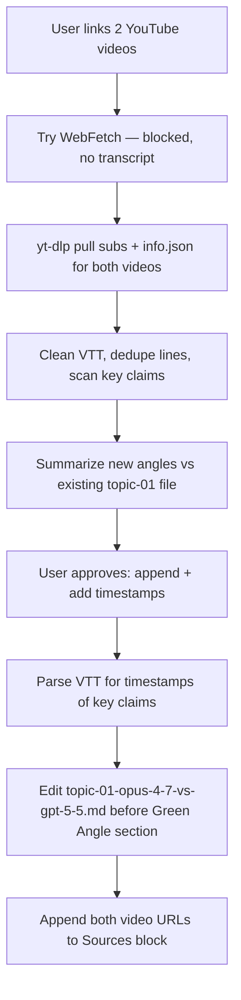

# 2026-04-28 - Ship Shit Show Live

## Summary

Pulled talking points from two YouTube reaction videos covering the Opus 4.7 / GPT-5.5 frontier showdown, then merged them into the existing topic file for today's livestream as fully timestamped reaction sections so the host can pull the videos up live and react beat-by-beat. TheAIGRID video added the buried tokenizer-change story (same sticker price, ~35% higher real cost), the AMD director regression quote, and the Mythos / Glass Wing enterprise-only allocation. Theo (t3.gg) video added live token-efficiency receipts (`22M`-token medium run = `5.4` X-high performance), OpenAI's first official "use low/medium reasoning" recommendation, and a context-pollution flaw in GPT-5.5 that maps cleanly to the harness pitch (code-review-graph, caveman, conversation compaction).

---

## Session 1: Livestream Topic — Add YouTube Reaction Sections

**Status:** Completed

### System Flow

### Affected Components

| Layer | Components |
|-------|------------|
| Livestream content | `apps/app/data/livestream/2026-04-28/topic-01-opus-4-7-vs-gpt-5-5.md` |
| Tooling used | `yt-dlp` (transcript fetch), Python re for VTT cleanup, Edit tool for file mods |
| External | YouTube `r5BLAFPk9Jo` (TheAIGRID), YouTube `HUsDzyJ3H64` (Theo / t3.gg) |

### What was done

- [x] Read existing topic file `topic-01-opus-4-7-vs-gpt-5-5.md` end-to-end so reaction sections wouldn't duplicate content
- [x] Fetched TheAIGRID video metadata + en subtitles via `yt-dlp`
- [x] Fetched Theo (t3.gg) video metadata + en subtitles via `yt-dlp`
- [x] Cleaned both VTT files into deduped plain-text transcripts for scanning
- [x] Identified novel angles per video that were not already in the topic file
- [x] Reported summary of both videos to user with recommendation to append
- [x] Parsed VTT cues with regex to map every key claim to a clean `m:ss` timestamp
- [x] Wrote `## Reaction — TheAIGRID Video` section with 12 timestamped beats
- [x] Wrote `## Reaction — Theo (t3.gg) Video` section with 15 timestamped beats
- [x] Inserted both sections directly before the existing `## Green Angle` block
- [x] Recovered from a stale-file Edit error after a linter touched the file mid-edit (re-read, re-anchored on a fresh line near the X Reactions block)
- [x] Appended both YouTube URLs to the `## Sources` block at end of file

### Key decisions

- **Decision:** Use `yt-dlp` to pull captions instead of trying WebFetch on YouTube
  - **Context:** WebFetch returned only page nav / footer text, no description, no transcript
  - **Rationale:** YouTube renders content client-side; auto-captions are the only reliable path to the full talking points without a Browser MCP

- **Decision:** Append reaction sections to the existing topic file rather than create a new topic file
  - **Context:** Today's livestream already has `topic-01-opus-4-7-vs-gpt-5-5.md` as the single topic
  - **Rationale:** Both videos are direct reactions to the exact same launch pair (Opus 4.7 vs GPT-5.5); splitting them out would fragment the host's read order during the stream

- **Decision:** Add timestamps in `m:ss` (or `h:mm:ss`) form, bold, inline at the start of each beat
  - **Context:** Host wants to react live to the videos
  - **Rationale:** Bolded leading timestamp is scannable at a glance and matches YouTube's own seek format so the host can paste-jump

- **Decision:** Insert both reactions before `## Green Angle`, not at the end of the file
  - **Context:** File already has a strong narrative arc that ends with Hot Take + Sources
  - **Rationale:** Keeping Green Angle → Hot Take → Sources as the closing arc preserves the topic's flow; reactions slot in as supporting commentary right after the X Reactions block

- **Decision:** Surface TheAIGRID's tokenizer-change claim as the headline of his section, not bury it
  - **Context:** TheAIGRID himself does not lead with this — he opens with benchmark commentary
  - **Rationale:** The 1.0x–1.35x tokenization shift is the most directly indie-dev-relevant claim in the entire video; it ties straight into the topic's existing Token Margin Game section

- **Decision:** Surface Theo's context-pollution / kill-the-thread complaint as the headline of his section
  - **Context:** Theo's main critique of GPT-5.5 is that bad info entering the context can't be prompted out
  - **Rationale:** This is a clean live-demo bridge into the harness pitch — code-review-graph (scope reads), caveman (compress output), conversation compaction (drop rot)

### Files changed

| File | Change |
|------|--------|
| `apps/app/data/livestream/2026-04-28/topic-01-opus-4-7-vs-gpt-5-5.md` | Added two new sections (`Reaction — TheAIGRID Video`, `Reaction — Theo (t3.gg) Video`) before `## Green Angle`. Appended both YouTube URLs to `## Sources`. Net `+87 / -13` lines per `git diff --stat`. |

### Mistakes and fixes

- **Mistake:** First Edit attempt failed with "File has been modified since read" because a linter / hook touched the file between the initial Read and the Edit
  - **Fix:** Re-Read the affected line range (the `X References` → `X Reactions To Pull Up Live` rename had also happened), re-anchored the new content on the fresh `Land the bridge` line, Edit succeeded

- **Mistake:** Initial WebFetch attempt on YouTube was a guaranteed dead end — should have skipped straight to `yt-dlp`
  - **Fix:** Pivoted to `yt-dlp --write-auto-sub --write-sub --sub-lang en --write-info-json --skip-download` for both URLs; both fetched in under a second each
  - **Lesson:** For YouTube content, default to `yt-dlp` for transcripts + metadata; never burn a WebFetch on a YouTube page

### Reference data captured this session

- TheAIGRID `r5BLAFPk9Jo`: "Opus 4.7 Just Dropped — Here's What Everyone Missed" (18:31, Apr 17 2026)
  - Headline beats: tokenizer change `[15:13]`, AMD director quote `[13:23]`, Mythos / Glass Wing `[13:40]`, jagged frontier `[9:21]`, GDP-Val `1753` `[5:49]`, SimpleBench regression `[16:54]`
- Theo (t3.gg) `HUsDzyJ3H64`: "I don't really like GPT-5.5…" (27:08, Apr 24 2026)
  - Headline beats: `22M`-token medium run `[7:46]`, OpenAI recommends low/medium `[9:28]`, context pollution flaw `[18:43–18:59]`, GPT-5.5 Pro Defcon solves `[21:19]`, "should've been GPT-6" `[26:48]`, Anthropic banned OpenAI from running its models `[4:22]`

### Next steps

- [ ] Host: pre-load both videos in browser tabs + queue exact timestamps before going live
- [ ] During stream, lead the Anthropic Angle reaction with TheAIGRID `[15:13]` tokenizer clip — strongest indie-dev hook
- [ ] During stream, lead the OpenAI Angle reaction with Theo `[7:46]` token numbers — best live receipt for the `72%` claim
- [ ] Use Theo `[18:43–18:59]` context-pollution clip as the bridge into the ShipCode demo (code-review-graph + caveman + compaction)
- [ ] Consider a separate stream-day commit for the topic file edits before going live; currently the change is staged-but-uncommitted on `master`
- [ ] After stream, fold any new audience reactions back into the topic file under a fresh "Audience Pushback" subsection if there's signal worth keeping
